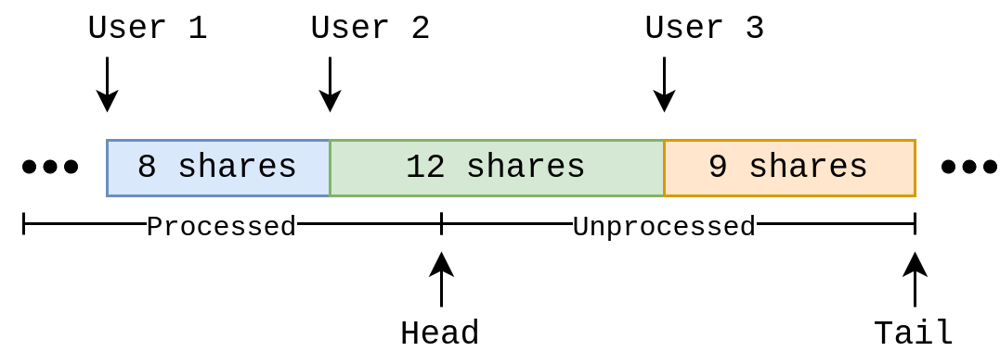

# Redemption Design

## Overview

This document describes the redemption system in MetaStreet v2 Pools.
Redemption is the process of converting shares to cash that can be withdrawn.
It is the inverse operation of depositing.

Redemptions occur instantly when sufficient cash is available. In this case,
shares are converted to cash at the current tick price (`value / shares`) and
made available for withdrawal to the user. When cash is unavailable because it
is all currently deployed into loans, redemptions are scheduled and fulfilled
with future proceeds.

As loans are repaid or liquidated, the cash restored to a tick is used to first
service any scheduled redemptions, then the remaining is made available for new
loans. This ensures that a user's redemption removes their deposit from any
future loan activity. Redemptions are first-come, first-serve within a tick.

Scheduled redemptions may be fulfilled across multiple proceeds events (e.g.
loan repaid or collateral liquidated), in which batches of shares are converted
at different prices as the tick value changes. In the case that a tick becomes
insolvent due to a liquidation, redemption shares are converted to zero amount.

## Model

Since each tick manages its own shares, redemptions are handled in each tick
independently. Each tick's redemption state consists of an infinite queue with
a head pointer and tail pointer. To schedule a redemption, the tail of the
queue is advanced by the number of shares to redeem. As redemptions are
processed, the head of the queue is advanced by the number of shares redeemed.



A user tracks their redemption progress by snapshotting the tail pointer when
scheduling a redemption. As the head pointer moves beyond the snapshot, the
redemption of the user's shares has begun. When the head pointer has moved
beyond the snapshot plus the user's total pending shares, the entire user's
redemption has been processed.

## Implementation

The redemption model described above is implemented with a few modifications to
account for redemptions occurring at different prices. As a tick experiences
loan repayments or liquidations, the value of the tick changes with interest or
losses, and this affects the price at which shares are redeemed.

### Tick Redemption State

Tick redemption state in [`LiquidityManager`](../contracts/LiquidityManager.sol):

```solidity
struct Node {
    uint128 value;
    uint128 shares;
    uint128 available;
    ...
    Redemptions redemptions;
}

struct Redemptions {
    uint128 pending;
    uint128 index;
    mapping(uint128 => FulfilledRedemption) fulfilled;
}

struct FulfilledRedemption {
    uint128 shares;
    uint128 amount;
}
```

Each liquidity `Node` contains the current tick `value`, outstanding `shares`,
cash `available`, and a `redemptions` substructure. The `redemptions.pending`
counter contains the current pending number of shares to redeem. The
`redemptions.index` is the current index into the fulfilled redemption queue
`redemptions.fulfilled`. The fulfilled redemption queue is an infinite array of
`FulfilledRedemption` structures, each of which logs a redemption containing
the number of shares redeemed and the amount they were redeemed for.

The current index into the fulfilled redemption queue always points to an empty
entry.

### Deposit Redemption State

Deposit redemption state in [`Pool`](../contracts/Pool.sol):

```solidity
mapping(address => mapping(uint128 => Deposit)) internal _deposits;

struct Deposit {
    uint128 shares;
    uint128 redemptionPending;
    uint128 redemptionIndex;
    uint128 redemptionTarget;
}
```

Each user's `Deposit` for a tick contains the count of `shares`, the number of
shares pending to be redeemed in `redemptionPending`, and a snapshot of the
redemption queue at time of redemption formed by `redemptionIndex` and
`redemptionTarget`.

### Scheduling

Scheduling a redemption begins with the [`redeem()`](../contracts/Pool.sol#L1149) function, in which
a user specifies a number of shares to redeem from a tick. The function
validates the user's state, and then calls [`redeem()`](../contracts/LiquidityManager.sol#L506) within the
`LiquidityManager` to schedule the redemption within the tick.

The underlying [`redeem()`](../contracts/LiquidityManager.sol#L506) function snapshots the node's current `redemption.index`
and `redemption.pending` state, and then advances `redemption.pending` by the
number of shares to redeem. The queue snapshot is returned to the `Pool`, and
stored in the `Deposit` state as `redemptionIndex` and `redemptionTarget`,
along with the number of shares scheduled for redemption in
`redemptionPending`.

The snapshot `redemptionIndex` points to the current empty entry in the
fulfilled redemption queue, while `redemptionTarget` is the number of shares
ahead of the user's redemption. As redemptions are fulfilled, the fulfilled
redemption queue can be scanned starting from the snapshot to determine if and
how many of the user's shares have been redeemed.

### Processing

As loans are repaid or liquidated, [`restore()`](../contracts/LiquidityManager.sol#L479) in `LiquidityManager`
is called on the tick to update the tick's value and cash available with the
repayment or incurred losses. This in turn calls [`_processRedemptions()`](../contracts/LiquidityManager.sol#L346),
which is responsible for using the available cash to process redemptions.

[`_processRedemptions()`](../contracts/LiquidityManager.sol#L346) computes a current redemption price using the current
`node.value` of the tick, and then determines the maximum number of shares it
can redeem at this price from the available cash. The number of shares redeemed
and the amount they are redeemed for are recorded in the fulfilled redemption
queue indexed by `node.redemptions.index`. The node's `shares`, total `value`,
cash `available` state are then decremented with the removed shares and
amounts. Finally, the redemption pending shares `node.redemptions.pending` are
decremented and the fulfilled redemption queue index `node.redemptions.index`
is advanced.

In the case that a tick is insolvent (i.e. the tick has outstanding `shares`,
but has zero or dust `value`), all pending shares for redemption are fulfilled
at a zero price for zero amount, and this is recorded in the fulfilled
redemption queue.

Deposits into a tick and redemptions from a tick also call
[`_processRedemptions()`](../contracts/LiquidityManager.sol#L346), to process redemptions from any available cash
immediately.

### Tracking

Users can track their redemption progress with the
[`redemptionAvailable()`](../contracts/Pool.sol#L1162) getter in `Pool`, which in turn calls the
[`redemptionAvailable()`](../contracts/LiquidityManager.sol#L196) helper in `LiquidityManager` with the user's
redemption pending shares and queue snapshot.

[`redemptionAvailable()`](../contracts/LiquidityManager.sol#L196) scans the fulfilled redemption queue, starting at
the index in the user's snapshot, until the number of redeemed shares exceeds
the target in the user's snapshot, indicating that the subsequent fulfilled
redemptions are now in range of the user's redemption. From this point,
redeemed shares and their amounts are accumulated up to the user's pending
shares to be redeemed.

When all of the user's shares are accounted for, or the end of the fulfilled
redemption queue is reached, the function returns with the total redeemed
shares and amount.

### Withdrawing

Users can withdraw their redeemed shares as cash with [`withdraw()`](../contracts/Pool.sol#L1188) in
`Pool`, which uses the [`redemptionAvailable()`](../contracts/LiquidityManager.sol#L196) helper in `LiquidityManager` to
determine how many shares have been redeemed and for what amount.

For a partial withdrawal, the user's `redemptionPending` is decremented and
`redemptionTarget` is advanced by the number of shares redeemed. This
effectively withdraws the head of the user's redemption that is ready, while
leaving the rest to be fulfilled later. For a full withdrawal, the
`redemptionPending`, `redemptionTarget`, and `redemptionIndex` state is simply
reset to zero. Finally, the function transfers the amount determined by
[`redemptionAvailable()`](../contracts/LiquidityManager.sol#L196) for the redeemed shares to the user in currency
tokens.

The user also has the option to use [`rebalance()`](../contracts/Pool.sol#L1204) to redeposit a
redeemed amount into another tick, instead of withdrawing it as currency
tokens. This function behaves the same way as [`withdraw()`](../contracts/Pool.sol#L1188), but deposits the
redeemed amount in another tick instead of transferring currency tokens.

### Performance

The redemption queue is designed to schedule and process redemptions in
constant time, so it can support concurrent redemptions from many users while
keeping repay and liquidate gas costs low and predictable.

Tracking and withdrawing redemptions for each user is linear time, due to the
scanning of the fulfilled redemption queue to find the user's redemption.
However, each entry in the fulfilled redemption queue is stored in a single
slot, and a fulfilled redemption entry can span many different user's shares
with the proceeds of a repaid or liquidated loan.
